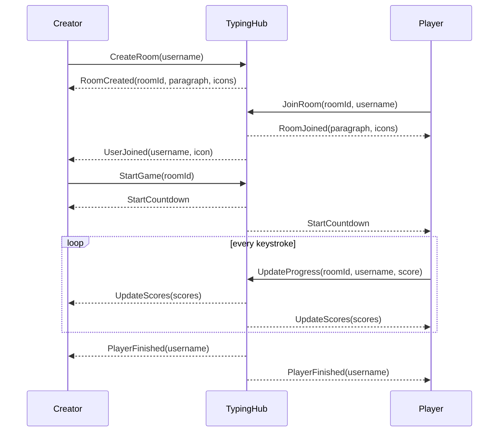

# TypingClub

A small real-time multiplayer **typing race game** built with **ASP.NET Core** and **SignalR**.

Players create a room, invite friends with a link, and race to type the same paragraph. Every player is shown as an icon on a shared race track, and the icons move as players type correctly. The creator starts a countdown, everyone types, and rankings appear when the last player finishes.

## Overview

TypingClub is a browser game with no accounts and no database. A single ASP.NET Core app does two things:

- serves a static HTML/JavaScript page, and
- hosts a SignalR hub that holds the game state in memory and pushes updates to every player in a room.

The project is a compact example of room-based, real-time communication. Clients call hub methods such as `JoinRoom` or `UpdateProgress`, and the server broadcasts events back to everyone in the room's SignalR group.

## Features

- **Rooms:** create a room with a unique ID, or join an existing one by ID.
- **Invite links:** copy a link like `/index.html?room=<id>`. Opening it prompts for a username and joins the room automatically.
- **Player icons:** each player gets a random icon from 15 built-in images. The icon is their "car" on the race track.
- **Countdown start:** the room creator starts the race. Everyone gets a 7-second countdown, and the paragraph stays blurred until the countdown begins.
- **Live progress:** your score is the number of characters typed correctly from the start. Counting stops at the first mistake, and the text box turns red until you fix it.
- **Leaderboard and timers:** live scores for every player, plus a timer next to each name.
- **Rankings:** when all players finish, a ranking by finish time is shown.
- **Rematches:** the creator can start another race. A new paragraph is picked at random from 17 built-in paragraphs.
- **Room status:** each room is *Waiting* or *In Progress*. New players can only join a room that is waiting.
- **Validation:** usernames must be unique within a room. Joining a missing, expired or busy room shows an error.
- **Cleanup:** rooms with no activity for 10 minutes are removed from memory.
- **Anti copy/paste:** copy, cut and paste are disabled on the paragraph.

## Tech Stack

| Area      | Technology                                                                     |
|-----------|--------------------------------------------------------------------------------|
| Backend   | C#, .NET 8, ASP.NET Core (minimal hosting)                                     |
| Real-time | ASP.NET Core SignalR (server), `@microsoft/signalr` 7.0.5 JavaScript client (loaded from cdnjs) |
| Frontend  | Plain HTML, CSS and vanilla JavaScript; Roboto font from Google Fonts          |
| Storage   | None: all state is kept in memory                                              |
| Tooling   | Visual Studio solution, Dockerfile                                             |

## Project Structure

```
TypingClub.sln
TypingClub/
├── Program.cs                  # Startup: static files, "/" redirect, SignalR hub endpoint
├── Hubs/
│   └── TypingHub.cs            # SignalR hub: create/join rooms, start races, progress updates
├── Models/
│   └── Room.cs                 # In-memory room state and the inactivity timeout
├── Helpers/
│   └── TypingConstants.cs      # Built-in paragraphs and the list of player icons
├── wwwroot/
│   ├── index.html              # The single game page
│   ├── js/site.js              # Client logic: SignalR events, race track, typing checks, timers
│   ├── css/site.css            # Styles
│   └── images/                 # Player icons
├── Properties/launchSettings.json
├── appsettings.json
└── Dockerfile
```

## How It Works

The server keeps all rooms in a static `ConcurrentDictionary<string, Room>` inside `TypingHub`. Each room maps to a **SignalR group** named after the room ID, so a message sent to that group reaches every player in the room.



1. **Connect:** `index.html` loads `site.js`, which connects to the hub at `/typingHub`. If the URL has a `?room=` parameter, the client asks for a username and joins that room.
2. **Create:** `CreateRoom` creates a `Room` with a GUID, a random paragraph and the creator's icon. It adds the caller to the room's group and starts the inactivity timer.
3. **Join:** `JoinRoom` checks that the room exists, is waiting, and doesn't already have that username. On success, the caller gets `RoomJoined` and the group gets `UserJoined`. On failure, the caller gets an `Error` message.
4. **Start:** `StartGame` marks the room *In Progress* and sends `StartCountdown`. If a race was already played, it first clears the old scores and sends a new paragraph with `NewTextGenerated`. The Start button is only shown to the room creator.
5. **Type:** on every input, the client works out how many leading characters are correct and sends that score with `UpdateProgress`. The server stores it and broadcasts `UpdateScores`, which moves each car along the track in proportion to the paragraph length.
6. **Finish:** when a score reaches the paragraph length, the server sends `PlayerFinished`. Each client stops that player's timer. Once every player has finished, the client shows the rankings and resets the board, and the server sets the room back to *Waiting*.
7. **Expire:** creating a room, joining it or starting a race restarts a 10-minute timer (`Room.StartTimeout`). If the timer runs out, the room is removed.

### Hub API

| Client → Server                           | Server → Client                                   |
|-------------------------------------------|---------------------------------------------------|
| `CreateRoom(username)`                    | `RoomCreated(roomId, text, userIcons)`            |
| `JoinRoom(roomId, username)`              | `RoomJoined(text, userIcons)`, `UserJoined(username, icon)` |
| `StartGame(roomId)`                       | `NewTextGenerated(text)`, `StartCountdown()`      |
| `UpdateProgress(roomId, username, score)` | `UpdateScores(scores)`, `PlayerFinished(username)` |
|                                           | `Error(message)`                                  |

## Getting Started

### Prerequisites

- [.NET 8 SDK](https://dotnet.microsoft.com/download/dotnet/8.0)
- Internet access in the browser: the SignalR client and the font are loaded from CDNs
- *(Optional)* Docker, or Visual Studio 2022

### Installation

```bash
git clone https://github.com/Erfan4708/TypingClub.git
cd TypingClub
dotnet restore
```

## Running the Project

### With the .NET CLI

```bash
dotnet run --project TypingClub
```

This uses the `http` profile from `Properties/launchSettings.json`. Open **http://localhost:5113**.

Other options:

```bash
# HTTPS profile (https://localhost:7144). Trust the development certificate first if needed:
dotnet dev-certs https --trust
dotnet run --project TypingClub --launch-profile https

# Any other address, e.g. if the default port is unavailable on your machine
dotnet run --project TypingClub --no-launch-profile --urls http://localhost:8080
```

### With Visual Studio

Open `TypingClub.sln` and run the `http`, `https` or `Container (Dockerfile)` profile.

### With Docker

The Dockerfile expects the **repository root** as its build context:

```bash
docker build -f TypingClub/Dockerfile -t typingclub .
docker run --rm -p 8080:8080 typingclub
```

Then open **http://localhost:8080**.

## Configuration

No API keys, secrets, database or environment variables are required.

- `appsettings.json` / `appsettings.Development.json` contain only the standard logging settings and `AllowedHosts`.
- The usual ASP.NET Core settings still apply, such as `ASPNETCORE_ENVIRONMENT` and `ASPNETCORE_URLS` (or `--urls`).
- Game settings live in code:

| Setting                   | Location                                   | Default    |
|---------------------------|--------------------------------------------|------------|
| Room inactivity timeout   | `Room.TimeoutMinutes` in `Models/Room.cs`  | 10 minutes |
| Countdown length          | `StartCountdown` handler in `wwwroot/js/site.js` | 7 seconds |
| Paragraphs                | `TypingConstants.Paragraphs`               | 17 texts   |
| Player icons              | `TypingConstants.DefaultAvailableIcons`    | 15 images  |

## Usage

1. Open the app, enter a username and click **Create Room**.
2. Click **Invite Friend** to copy an invite link, or **Copy** to copy the room ID.
3. Friends open the invite link, or paste the room ID, enter a username and click **Join Room**. Everyone in the room appears on the race track.
4. The creator clicks **Start Game**. After the countdown, type the paragraph into the text box.
5. When everyone has finished, the rankings pop up. The creator can then start a rematch with a new paragraph.

## Testing

The repository has no automated test suite. To check it by hand, open the app in two browser windows, create a room in one, join from the other, and play a race.

## Known Limitations

The project is intentionally small and is not production-ready:

- **In-memory, single instance:** restarting the server clears all rooms, and there is no SignalR backplane for running more than one instance.
- **Trusted clients:** the server accepts the scores clients send, and the "only the creator can start" rule is enforced in the UI only.
- **Client-side timing:** finish times come from each browser's timer, with one-second resolution.
- **No disconnect handling:** if a player leaves mid-race, the others never reach the rankings screen, and the room stays *In Progress* until it expires.
- **No room size limit:** the race track grows with each player, and every player after the 15th gets the same fallback icon.
